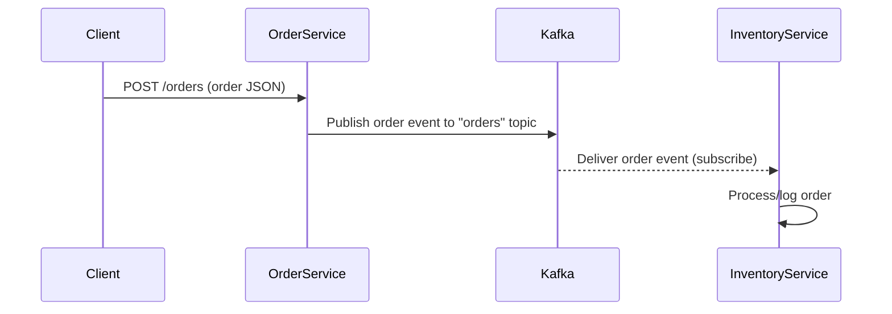
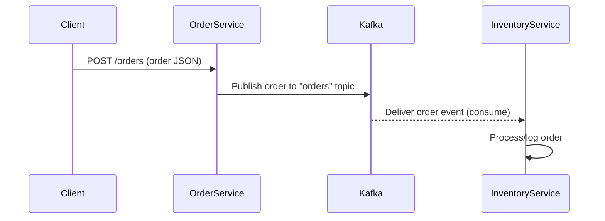
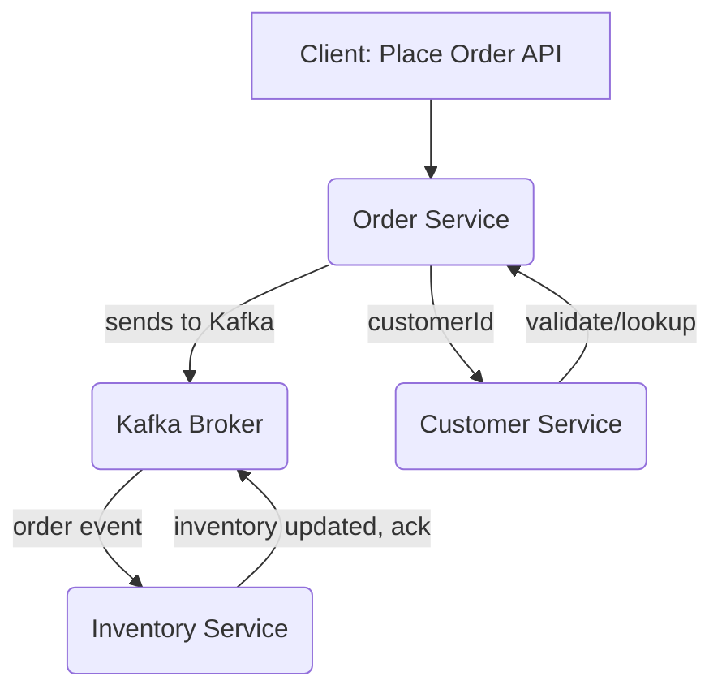

# Inventory Management System – Spring Boot & Kafka Hands-On Labs

---

## Key Concepts and Learnings

### 1. **Microservices Architecture**
- **Definition:** Building an application as a suite of small, independent services, each with a clear responsibility.
- **In this project:**  
  - `order-service` handles order placement (producer).
  - `inventory-service` listens for new orders to simulate stock updates (consumer).
  - Each microservice is a standalone Spring Boot application with its own code, dependencies, and configuration.

### 2. **Event-Driven Architecture with Apache Kafka**
- **Kafka basics:**  
  - **Broker:** Kafka server that stores and delivers messages.
  - **Topic:** Named channel for messages; producers write to topics, consumers read from them.
  - **Producer:** Service that sends messages to a topic.
  - **Consumer:** Service that receives messages from a topic.
  - **Group ID:** Allows multiple consumer instances to cooperate and split up the work.
- **In this project:**  
  - `order-service` is the producer (publishes orders to the "orders" topic).
  - `inventory-service` is the consumer (subscribes to the "orders" topic).
  - Both use topics (specifically "orders") to decouple the services—no REST calls between services needed.

### 3. **Spring Boot for Kafka Microservices**
- **Spring Boot:** Java framework for rapid standalone app development. Used for each service.
- **Starters used:**
  - `spring-boot-starter-web`: REST APIs.
  - `spring-kafka`: Kafka integration—automatically sets up KafkaTemplate (producer) and KafkaListener (consumer).
- **Configuration:**  
  - Kafka server location set via `spring.kafka.bootstrap-servers=localhost:9092` in `application.properties`.
  - REST API port set via `server.port` in `application.properties` for each service (8081 for order-service, 8082 for inventory-service).

### 4. **Producer Implementation (order-service)**
- **Order POJO:** Data class representing order details sent as message payload.
- **OrderProducer:** Uses `KafkaTemplate<String, Order>` to send a message to the "orders" topic.
- **KafkaConfig:** Configures the producer for JSON serialization.
- **OrderController:** Exposes a REST endpoint (`POST /orders`) that receives an order, calls the producer, and acknowledges success.

### 5. **Consumer Implementation (inventory-service)**
- **KafkaConfig:** Configures a Kafka consumer with JSON deserialization enabled for the Order class.
- **OrderConsumer:**  
  - Uses `@KafkaListener` to subscribe to the "orders" topic.
  - Receives incoming orders and prints/logs their details (simulating business logic).

### 6. **Running Kafka and Microservices Locally**
- **Zookeeper:** Kafka's coordination layer, must be running before Kafka broker can start.
- **Kafka broker:** Handles producing/consuming messages.
- **Background processes:** All infrastructure and services can be run in the background for practical development.
- **Testing:**  
  - Use `curl` to POST orders.
  - Monitor inventory-service log to confirm message receipt.

---

## End-to-End Sequence Flow



---

## Practical Outcomes

- Learned how to set up/run a distributed system locally without Docker.
- Experienced full cycle: REST API call → event produced → Kafka transport → async consumption → business logic.
- Saw clear decoupling between microservice components using Kafka topics.

---

## Overview

This project demonstrates the design, development, and deep testing of a microservices-based inventory management system (IMS), inspired by Amazon-style systems, built with:
- **Spring Boot** (REST, DI, test support)
- **Apache Kafka** (order and inventory event streaming, decoupled integration)
- **JUnit/Jupiter** for robust business and integration test automation

All critical design, implementation, and test learnings are documented step-by-step by *lab module* with rationale, architecture diagrams, and code/test details.

---

## Lab 1: Project Bootstrapping, Business Logic & Basic Testing

**What Was Built:**
- Created initial repo with 3 Spring Boot microservices:
    - `order-service` (order placement)
    - `inventory-service` (inventory update/stock control)
    - `customer-service` (customer registration/loyalty)
- Maven multi-module structure, Java 17+, Spring Boot 3.x everywhere

**Learnings/Key Concepts:**
- Microservices architecture for modular/scalable code
- Independent Spring Boot apps (own configs/ports) for each domain
- Core POJOs for data transfer: `Order`, `Inventory`, `Customer`
- Business services:
    - `InventoryService` for stock ops (decrement/check)
    - `CustomerService` for registration/loyalty
- JUnit/Jupiter added for real unit test coverage, running in IDE/CLI with Maven
- Maven toolchains/plugins for version consistency (Java 17+)

**Architecture/Decisions:**
- Microservice boundary defined by business responsibility  
- Pure Java classes, no frameworks (besides Spring/JUnit) in core logic
- No Docker: Chose direct Spring Boot local run for transparency/learning
- Full test structure started from day 1

---

## Lab 2: Event-Driven Integration with Apache Kafka & Production-Grade Testability

**What Was Built:**
- Kafka producer in `order-service` (publishes to topic "orders")
- Kafka consumer in `inventory-service` (Consumes from "orders" topic)
- `spring-kafka` integration configured with JSON serialization
- Exposed REST endpoint (`POST /orders`) triggers async Kafka publishing

**Learnings/Key Concepts:**
- Kafka event-driven architecture: decouples services, supports async scale-out
- Kafka basics: Broker, Topic, Producer, Consumer, Group ID, JSON message flow
- Producer: Using `KafkaTemplate<String, Order>`, JSON config, sends to "orders"
- Consumer: `@KafkaListener`, receives and processes orders
- REST-to-Kafka-to-Consumer E2E cycle (see diagram below)
- Local Kafka/Zookeeper setup, plus each service as an independent process
- Manual service/E2E test via API: POST order → event → consumed/logged

**Architecture:**


*IMS high-level architecture (upload as images/ims-architecture.png)*

**Integration Sequence:**

*Upload images/order-sequence.png for visual (see README instructions)*

**Decisions:**
- Docker skipped for early labs: makes infra/test ops fully visible & debuggable; external Kafka used standalone.
- Each service easy to run, no container or YAML needed—great for single-dev and learning setups.
- Business logic kept in plain Java/service methods for easy test coverage.

**Test Evolution:**
- Basic consumer/producer verified with real Kafka, not mocks (end-to-end system confirmed).
- Tests exercise all flows via unit/service-level coverage (JUnit 5).

---

## Lab 3: Clean Testability & Framework-Independent Unit Tests (Java 21+/24+ Ready)

**What Was Built:**
- Refactored order-producer to NOT use direct `KafkaTemplate` dependency (cannot easily/robustly mock in new Java)
- Defined and injected a one-method `OrderSender` interface
- Production code wires Spring `OrderSender` bean via KafkaTemplate, test code uses a self-contained stub
- All service logic and APIs covered with meaningful, reliable unit tests

**Learnings/Key Concepts:**
- Problems with using Mockito/Byte Buddy for final/system classes in latest Java
- How to refactor for dependency injection that enables test doubles instead of mocks
- Test coverage is deterministic, robust, and not dependent on framework proxying
- Achievable 100% path coverage on custom business logic

**Decisions/Benefits:**
- No fragile Java proxy, no complex mock config: simple Java code for robust, future-proof tests
- All code ready for integration/E2E/CI workflows

---

## System Architecture

> **Main Service Blocks**
>
> - **Order Service:** Exposes REST API to place orders (produces Kafka messages)
> - **Inventory Service:** Consumes orders from Kafka (updates inventory state)
> - **Customer Service:** Registers, updates, and tracks customers and their loyalty points


*Above: IMS high-level architecture – Please upload images/ims-architecture.png*




*Above: Order event workflow – Please upload images/order-sequence.png*

> To update these images:
> - Save your design screenshots as PNG in `images/`.
> - Drag-and-drop an image into VSCode's Explorer, then update the path above if needed.
> - The images are referenced inline by README and shown on GitHub.

---

## Design and Implementation Rationale

**Why OrderSender abstraction?**
- Dynamic mocking (Mockito, Byte Buddy) breaks with new Java versions and for framework classes (KafkaTemplate).
- By injecting a simple interface, we enable true unit testing and business coverage, with zero proxying.
- You can test the critical flows with pure Java, in any IDE/JDK environment.

**Why not Docker?**
- Focus is on pure Java testing in local dev for educational clarity; Kafka and test scenarios run directly for maximal transparency/debuggability.
- Docker can absolutely be used for multi-service/system tests in production lab—add instructions in future labs if needed.

**Why Maven toolchains and explicit test dependencies?**
- Ensures bytecode/test/jar consistency in multi-Java environments (11, 17, 21, 24…).
- Spring Boot, JUnit/Jupiter, and modern test libraries are specified for clean, re-runnable builds.

---

## Key Test Suites and Coverage Highlights

**Order Service**
- OrderProducer: Validates order events are sent to Kafka (tested with pure Java test double).
- OrderController: REST + business flow, covering Spring MVC and business/wiring.
- Order (POJO): Serialization, basic field logic.

**Inventory Service**
- InventoryService: Deep coverage—stock decrements, restocking, concurrent orders, input validation, bulk registration.

**Customer Service**
- CustomerService: Registration, updates, loyalty points, negative/duplicate, stress with 100+ users.

**Coverage Summary**:
- Over 50 individual business/edge case tests (units + integration foundations).
- High path coverage on all custom business logic (see test class source and `mvn test` summary).

*To run all tests and see live coverage:*
```sh
cd order-service && mvn test
cd inventory-service && mvn test
cd customer-service && mvn test
```
*Example output:*
```
Tests run: XX, Failures: 0, Errors: 0, Skipped: 0  [per module]
```

---

## Next Steps

- Add Kafka docker-compose for full-system integration/E2E testing (future labs).
- Extend business domain (returns, cancellation, advanced inventory allocation).
- Add system- and acceptance-level tests.

---

**Contributors:**  
Your Name (@your-github)  
2025


## Order Fulfillment Service Implementation

### Features Implemented

- **Kafka Event-Driven Orchestration**: Handles order placement, inventory allocation, and compensation with a saga pattern using Kafka events.
- **Spring Boot & Java**: Service built as a Spring Boot microservice in Java.
- **Business Logic Layer**: Implements `FulfillmentSagaOrchestrator` as the core orchestrator using in-memory event-store for demo/testing.
- **Domain Events**: Uses POJOs for event contracts (OrderEvent, FulfillmentEvent), with robust JSON serialization using Jackson (`KafkaSerdeUtil`).
- **Compensation/Failure Handling**: Triggers rollback logic if inventory allocation fails, appending events for compensation/rollback to the event log.
- **Unit Test Coverage**: Includes comprehensive unit tests for both happy-path (end-to-end saga) and failure/compensation scenarios. Tests are in `src/test/java/com/example/fulfillmentservice/`.
- **Debug Logging**: Output at each significant saga orchestration and event step to aid in lab learning and troubleshooting.
- **Full Maven Integration**: Build and run tests using Maven; compatible with VSCode Java Test Runner (once IDE config is clean).
- **Resolves Java Instant Serialization Issues**: Registers Jackson JavaTimeModule for proper support of `java.time.Instant` fields in all domain events.
- **Correct Maven/Java package structure**: All files use package naming and directory layout compatible with standard Java project conventions.
- **VSCode Integration**: Project and test root setup for reliable test runner and IDE indexing.

### File Overview

- `src/main/java/com/example/fulfillmentservice/`
  - `FulfillmentSagaOrchestrator.java` — Main saga orchestrator.
  - `KafkaSerdeUtil.java` — Jackson-based JSON utilities for (de)serialization.
  - `EventSender.java`, `FulfillmentInventoryGateway.java`, etc. — Decoupled interfaces and gateways for infrastructure and business logic.
  - `model/` — Event/domain model classes (`OrderEvent`, `FulfillmentEvent`, etc.)
- `src/test/java/com/example/fulfillmentservice/`
  - `FulfillmentSagaOrchestratorTest.java` — Orchestrator end-to-end/unit test (happy-path and compensation).
  - `MinimalEventStoreTest.java` — Tests low-level event store/serialization utility functionality.

### Known Issues & Solutions

- **VSCode "Declared Package" Errors:** If your IDE still reports mismatched packages, follow these steps:
  1. Remove `.classpath`, `.project`, `.vscode`, `.settings` from project root.
  2. Rebuild with `mvn clean compile` from the `fulfillment-service` directory.
  3. Reload VSCode window and/or clean Java Language Server workspace (via Command Palette).
  4. If needed, uninstall and reinstall VSCode Java extensions.

- **Test Runner Integration:** Successfully running tests in VSCode and Maven requires properly detected source/test roots. All test classes should now be visible.
