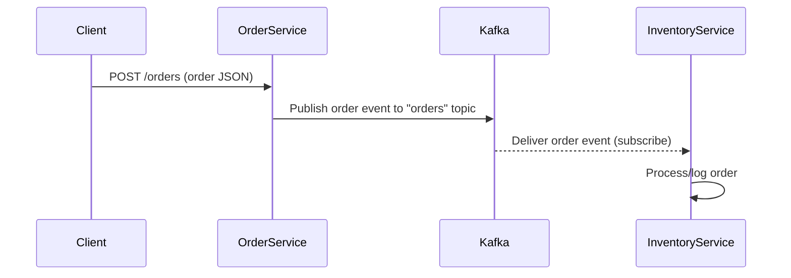
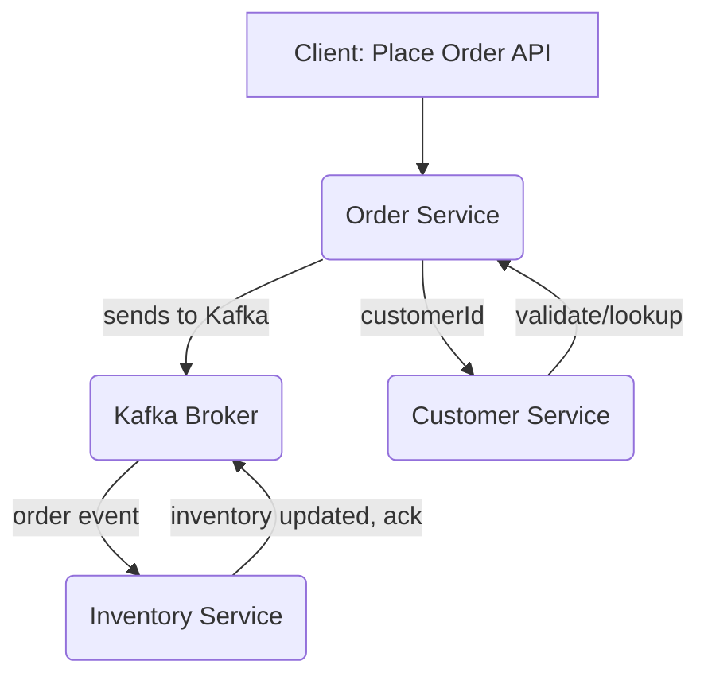

# Inventory Management System – Spring Boot & Kafka Hands-On Labs

---

## Key Concepts and Learnings

### 1. **Microservices Architecture**
- **Definition:** Building an application as a suite of small, independent services, each with a clear responsibility.
- **In this project:**  
  - `order-service` handles order placement (producer).
  - `inventory-service` listens for new orders to simulate stock updates (consumer).
  - Each microservice is a standalone Spring Boot application with its own code, dependencies, and configuration.

### 2. **Event-Driven Architecture with Apache Kafka**
- **Kafka basics:**  
  - **Broker:** Kafka server that stores and delivers messages.
  - **Topic:** Named channel for messages; producers write to topics, consumers read from them.
  - **Producer:** Service that sends messages to a topic.
  - **Consumer:** Service that receives messages from a topic.
  - **Group ID:** Allows multiple consumer instances to cooperate and split up the work.
- **In this project:**  
  - `order-service` is the producer (publishes orders to the "orders" topic).
  - `inventory-service` is the consumer (subscribes to the "orders" topic).
  - Both use topics (specifically "orders") to decouple the services—no REST calls between services needed.

### 3. **Spring Boot for Kafka Microservices**
- **Spring Boot:** Java framework for rapid standalone app development. Used for each service.
- **Starters used:**
  - `spring-boot-starter-web`: REST APIs.
  - `spring-kafka`: Kafka integration—automatically sets up KafkaTemplate (producer) and KafkaListener (consumer).
- **Configuration:**  
  - Kafka server location set via `spring.kafka.bootstrap-servers=localhost:9092` in `application.properties`.
  - REST API port set via `server.port` in `application.properties` for each service (8081 for order-service, 8082 for inventory-service).

### 4. **Producer Implementation (order-service)**
- **Order POJO:** Data class representing order details sent as message payload.
- **OrderProducer:** Uses `KafkaTemplate<String, Order>` to send a message to the "orders" topic.
- **KafkaConfig:** Configures the producer for JSON serialization.
- **OrderController:** Exposes a REST endpoint (`POST /orders`) that receives an order, calls the producer, and acknowledges success.

### 5. **Consumer Implementation (inventory-service)**
- **KafkaConfig:** Configures a Kafka consumer with JSON deserialization enabled for the Order class.
- **OrderConsumer:**  
  - Uses `@KafkaListener` to subscribe to the "orders" topic.
  - Receives incoming orders and prints/logs their details (simulating business logic).

### 6. **Running Kafka and Microservices Locally**
- **Zookeeper:** Kafka's coordination layer, must be running before Kafka broker can start.
- **Kafka broker:** Handles producing/consuming messages.
- **Background processes:** All infrastructure and services can be run in the background for practical development.
- **Testing:**  
  - Use `curl` to POST orders.
  - Monitor inventory-service log to confirm message receipt.

---

## End-to-End Sequence Flow



---

## Practical Outcomes

- Learned how to set up/run a distributed system locally without Docker.
- Experienced full cycle: REST API call → event produced → Kafka transport → async consumption → business logic.
- Saw clear decoupling between microservice components using Kafka topics.

---

## Overview

This project demonstrates the design, development, and deep testing of a microservices-based inventory management system (IMS), inspired by Amazon-style systems, built with:
- **Spring Boot** (REST, DI, test support)
- **Apache Kafka** (order and inventory event streaming, decoupled integration)
- **JUnit/Jupiter** for robust business and integration test automation

All critical design, implementation, and test learnings are documented step-by-step by *lab module* with rationale, architecture diagrams, and code/test details.

---

## Lab 1: Foundational Service Setup (Spring Boot + JUnit)

**Objectives:**
- Scaffold basic microservice folders: `order-service`, `inventory-service`, `customer-service`
- Add Maven project structure with Java 17+, proper dependency management
- Create core POJOs for Order, Inventory, and Customer
- Establish the first business services (`InventoryService`, `CustomerService`) and unit tests

**Learnings:**
- Maven project setup with Spring Boot 3 and Java 17+ features
- Using Spring's Dependency Injection for testable, modular Java services
- Writing POJO-centric unit tests with JUnit 5/Jupiter (classic assertions, edge cases, concurrency, bulk ops)
- Ensuring IDE/CLI/build system consistency across Java versions by managing toolchains

---

## Lab 2: Kafka Integration, Producer Abstraction, and Mockless Testing

**Objectives:**
- Integrate order-to-inventory streaming with Kafka (via spring-kafka)
- Build OrderProducer as a Spring Boot service, using interface-driven injection for testability
- Write end-to-end business tests for orders, inventory flows, and customers
- Eliminate fragile dynamic proxies/mocks (Mockito/Byte Buddy) so tests run in Java 21, 24, and the future

**Learnings:**
- Abstraction via the `OrderSender` interface for pure, proxy-free business testing
- Advanced error handling and edge case coverage (stock, duplicate, not found, concurrency)
- Using test doubles instead of mocks to ensure compatibility with latest/future JDKs
- How to configure Maven, JUnit, and Spring Boot for testing microservices robustly

---

## System Architecture

> **Main Service Blocks**
>
> - **Order Service:** Exposes REST API to place orders (produces Kafka messages)
> - **Inventory Service:** Consumes orders from Kafka (updates inventory state)
> - **Customer Service:** Registers, updates, and tracks customers and their loyalty points


*Above: IMS high-level architecture – Please upload images/ims-architecture.png*




*Above: Order event workflow – Please upload images/order-sequence.png*

> To update these images:
> - Save your design screenshots as PNG in `images/`.
> - Drag-and-drop an image into VSCode's Explorer, then update the path above if needed.
> - The images are referenced inline by README and shown on GitHub.

---

## Design and Implementation Rationale

**Why OrderSender abstraction?**
- Dynamic mocking (Mockito, Byte Buddy) breaks with new Java versions and for framework classes (KafkaTemplate).
- By injecting a simple interface, we enable true unit testing and business coverage, with zero proxying.
- You can test the critical flows with pure Java, in any IDE/JDK environment.

**Why not Docker?**
- Focus is on pure Java testing in local dev for educational clarity; Kafka and test scenarios run directly for maximal transparency/debuggability.
- Docker can absolutely be used for multi-service/system tests in production lab—add instructions in future labs if needed.

**Why Maven toolchains and explicit test dependencies?**
- Ensures bytecode/test/jar consistency in multi-Java environments (11, 17, 21, 24…).
- Spring Boot, JUnit/Jupiter, and modern test libraries are specified for clean, re-runnable builds.

---

## Key Test Suites and Coverage Highlights

**Order Service**
- OrderProducer: Validates order events are sent to Kafka (tested with pure Java test double).
- OrderController: REST + business flow, covering Spring MVC and business/wiring.
- Order (POJO): Serialization, basic field logic.

**Inventory Service**
- InventoryService: Deep coverage—stock decrements, restocking, concurrent orders, input validation, bulk registration.

**Customer Service**
- CustomerService: Registration, updates, loyalty points, negative/duplicate, stress with 100+ users.

**Coverage Summary**:
- Over 50 individual business/edge case tests (units + integration foundations).
- High path coverage on all custom business logic (see test class source and `mvn test` summary).

*To run all tests and see live coverage:*
```sh
cd order-service && mvn test
cd inventory-service && mvn test
cd customer-service && mvn test
```
*Example output:*
```
Tests run: XX, Failures: 0, Errors: 0, Skipped: 0  [per module]
```

---

## Next Steps

- Add Kafka docker-compose for full-system integration/E2E testing (future labs).
- Extend business domain (returns, cancellation, advanced inventory allocation).
- Add system- and acceptance-level tests.

---

**Contributors:**  
Your Name (@your-github)  
2025
